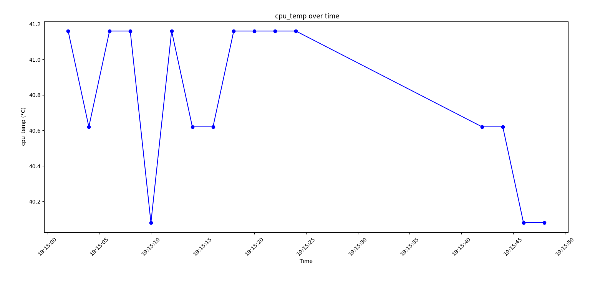

<p align="center"></p>
<h1 align="center">Run a program on your Raspberry Pi at Startup with Daemon Service SYSTEMD</h1> 
<h4 align="right">Aug 24</h4>


<br>

Usamos el systemd (el gestor de servicios de Linux), los archivos se ejecutan como servicios en segundo plano (daemons). Si necesitamos correr varios archivos, se pueden correr varios servicios independintes Este script permite crear de forma interactiva un servicio que se iniciara cada vez que se inicie la raspberry. Puede correr un archivo en Python, NodeJS o Bash. Para crear el servicio debemos tener presente:

1. Definir un nombre para el servicio.
2. Definir con que programa vamos abrir la aplicación (python3 -u, node o bash).
3. Tener la ruta del archivo a ejecutar (ejemplo: /home/carjavi/hello-world.py).


<br>

```create-autorun-service.sh```
```bash 
#!/usr/bin/env bash

# Define colors
readonly ANSI_RED="\033[0;31m"
readonly ANSI_GREEN="\033[0;32m"
readonly ANSI_YELLOW="\033[0;33m"
readonly ANSI_RASPBERRY="\033[0;35m"
readonly ANSI_ERROR="\033[1;37;41m"
readonly ANSI_RESET="\033[m"
readonly RASPAP_LATEST="2.0"

# Outputs a welcome message
function display_welcome() {
echo -e "${ANSI_RASPBERRY}\n"
echo -e "                            d8b                   d8b" 
echo -e "                            Y8P                   Y8P"
echo -e "                                                     "
echo -e " .d8888b  8888b.  888d888  8888  8888b.  888  888 888"
echo -e "d88P'        '88b 888P'    '888     '88b 888  888 888" 
echo -e "888      .d888888 888       888 .d888888 Y88  88P 888" 
echo -e "Y88b.    888  888 888       888 888  888  Y8bd8P  888" 
echo -e " 'Y8888P 'Y888888 888       888 'Y888888   Y88P   888" 
echo -e "                            888                      " 
echo -e "                           d88P                      " 
echo -e "                         888P'                       " 
echo -e "                                                     "
echo -e "${ANSI_GREEN}"
echo -e "The Quick Installer will guide you through a few easy steps${ANSI_RESET}"
echo -e "\033[1;32m***************************************************************$*\033[m"
echo -e "\n\n"
}

# calling Titulo 
display_welcome
    
#sleep 3seg
sleep 3

# Comprobando si el script se está ejecutando con privilegios de superusuario
if [ "$EUID" -ne 0 ]; then 
  echo "Por favor, ejecuta este script como root o utilizando sudo. ej: sudo ./create-autorun-service.sh --verbose."
  exit 1
fi

# Solicitar nombre del servicio
read -p "Ingresa el nombre del servicio: " SERVICE_NAME

# Path del archivo a correr
read -p "Path del archivo a correr (ejemplo: /home/carjavi): " FILE_PATH

# Solicitar comando ExecStart
read -p "Ingresa con que aplication se va a correr el serivicio (python3 -u /node /bash): " EXEC_START

# Nombre del archivo a correr
read -p "Nombre del archivo a correr (ejemplo: hello-world.py): " NAME_FILE

# Elimina la extensión del archivo usando 'basename'
NAME_NO_EXTENSION="${NAME_FILE%.*}"

echo
echo "------------------------------"
echo "Creating the service file..."
echo "------------------------------"
echo

# Contenido del archivo .service
SERVICE_CONTENT="[Unit]
Description=$SERVICE_NAME
After=network.target

[Service]
ExecStart=/bin/bash -c 'cd $FILE_PATH/ && $EXEC_START $NAME_FILE >> $NAME_NO_EXTENSION.log'
Restart=on-failure
StandardError=append:$FILE_PATH/${NAME_NO_EXTENSION}_error.log

[Install]
WantedBy=multi-user.target"

# Ruta al archivo .service
SERVICE_PATH="/etc/systemd/system/$SERVICE_NAME.service"

# Creando el archivo .service
echo "$SERVICE_CONTENT" > $SERVICE_PATH

echo
echo "-------------------------------------"
echo "$SERVICE_NAME Service created successfully."
echo "-------------------------------------"
echo

# permission (Propietario: Puede leer y escribir el archivo /Grupo y otros solo lectura)
chmod 644 /etc/systemd/system/$SERVICE_NAME.service

# Start deamon code
systemctl daemon-reload
systemctl enable $SERVICE_NAME
systemctl start $SERVICE_NAME

echo
echo "-------------------------------------"
echo "$SERVICE_NAME Service started successfully."
echo "-------------------------------------"
echo

# Delete installer
#create-autorun-service.sh

echo
echo "-------------------------------------"
echo "Ready. System will reboot in 10 seconds..."
echo "-------------------------------------"
echo

sleep 10 && reboot
```

<br>

> :warning: **Warning:** Para correr el archivo hay que darle permiso de ejecución:
```bash 
sudo chmod +x create-autorun-service.sh
```

## Run Script
```bash 
sudo ./create-autorun-service.sh --verbose
```

> :memo: **Note:** 
Se creará un archivo con el mismo nombre del servicio pero ```.log``` que registrará todas las salidas (stout) print/console del archivo que esta correindo. La salida no sobreescribirá el archivo sino que agregará al final del archivo sin sobreescribirlo por completo.

> Al usar ```journalctl``` no podremos ver las salidas (stout) en pantalla porque estan dirigidas al ```SERVICE_NAME.log```, si quieramos ver las salidas, deberiamos de quitar el direccionamiento al ```.log```, este; ```>> $NAME_NO_EXTENSION.log```
> 
> Si deseamos correr un archivo Python3, conviene usar la opción ```-u``` ya que ayuda a ver los valores de salida (stout) en tiempo real si usamos ```journalctl```.
>
> Si queremos borrar el ```log``` cada vez que inicie sera con un solo ```>```. 
>
>```Restart=always```: Reinicia el servicio siempre, independientemente de la razón por la cual se detuvo el servicio.Esto incluye fallos (errores) y paradas limpias (cuando el servicio se detiene manualmente o finaliza correctamente).Es útil en situaciones donde deseas que el servicio esté activo en todo momento, sin importar cómo se haya detenido. Es útil si deseas que el servicio siempre esté en ejecución, independientemente de si falla o termina correctamente.
>
>```Restart=on-failure```: Reinicia el servicio solo cuando falla, es decir, cuando el servicio termina con un código de error o una excepción inesperada. No reiniciará el servicio si este se detiene correctamente, ya sea porque completó su tarea o fue detenido manualmente mediante systemctl stop. Es preferible cuando solo quieres que el servicio se reinicie en caso de errores, pero no quieres que vuelva a empezar si termina sin problemas o es detenido manualmente.
>
> WantedBy=multi-user.target: Hace que el servicio se inicie automáticamente en el nivel de ejecución multiusuario.

<br>

# Daemon Service SYSTEMD commands (summary)
```bash 
sudo systemctl daemon-reload # Recarga su configuración. Esto es necesario después de hacer cambios en los archivos de configuración de unidades
sudo systemctl status SERVICE_NAME
sudo systemctl stop SERVICE_NAME
sudo systemctl start SERVICE_NAME
sudo systemctl disable SERVICE_NAME
sudo systemctl enable SERVICE_NAME
sudo systemctl restart SERVICE_NAME
systemctl --failed  #ver los servicios que fallaron
systemctl list-unit-files --type=service --state=enabled # Ver todos los servicios que inician automáticamente al arrancar el sistema

```
# Edit Service
> :warning: **Warning:** ```sudo systemctl daemon-reload```deberá ingresar este  comando cada vez que cambie su archivo .service,ya que systemd necesita saber que se ha actualizado.
```bash 
sudo nano /etc/systemd/system/SERVICE_NAME.service
```


# Debugging (Para ver los logs del servicio en vivo)
La salida de systemd (por ejemplo, sentencias print() o mensajes de error) es capturada por el sistema journalctl y se puede ver con el siguiente comando:
```bash 
sudo journalctl -f -u SERVICE_NAME
```
Esto puede dar una idea de lo que está pasando con su servicio o programa.
> :memo: **Note:** No se mostrará nada en pantalla si esta dirigido a un archivo ```.log```

# Delete service
```bash 
sudo rm /etc/systemd/system/SERVICE_NAME.service
sudo systemctl daemon-reload
sudo reboot
```
<br>

# Considerations
## Ejecutar directamente la aplicación desde el Daemon Service SYSTEMD
ejemplo:
```bash 
ExecStart=/usr/bin/python /path-to-your-python-project/python_file.py
```

```La forma más sencilla de ejecutar un script de Python, pero no se recomienda en la mayoría de los casos.``` El  no proporcionar la ruta correcta de Pythono y Nodejs traerá problema para reconocer los módulos y librerías necesarios para correr la aplicación. 

<br>

## Ejecutar Python o NodeJS dentro de la carpeta donde esta la aplicación en el Daemon Service SYSTEMD
ejemplo:
```bash 
ExecStart=/bin/bash -c 'cd /home/ubuntu/project/ && python app.py'
```
```Esta sería la mejor forma de correr una aplicación.``` Es mejor ir a la carpeta correspondiente y ejecutar scripts de Python o NodeJS allí. Te relajas con respecto a las rutas de carpetas que no coinciden. Ahora estamos usando bash para ejecutar varios scripts.

El comando ```bash -c``` se utiliza para ejecutar una cadena de comandos de Bash directamente desde la línea de comandos. ```-c``` Indica que lo que sigue es una cadena de comandos a ejecutar. separados por ```;```, ```&&```, o ```||```, dependiendo de cómo quieras encadenar la ejecución. ejemplo:
```bash 
bash -c "comando1; comando2; comando3"
```

<br>

## Ejecutar la aplicación con su entorno en el Daemon Service SYSTEMD
ejemplo python virtual environment (entorno virtual de Python):
```bash 
ExecStart=/bin/bash -c 'cd /home/ubuntu/project/ && source env/bin/activate && python app.py'
```
Esta es otra forma recomendada. Después de eso, puedes agregar tantos comandos como quieras

<br>

# Troubleshooting

En caso de error como: ```/usr/bin/env: ‘bash\r’: No such file or directory``` <br>
es porque el archivo no esta en formato Unix/linux. Solución:<br>

**Option 1**<br>
Usar un editor de texto con soporte para Unix, asegúrate de guardar el archivo en formato Unix:<br>

```VS Code:``` Cambia el formato de final de línea desde la barra de estado en la esquina inferior derecha **(cambiar de CRLF a LF)**.

**Option 2**<br>
Esta app transformará el archivo windows a Unix/linux 
```
sudo apt-get install dos2unix
dos2unix name_script.sh
```

**Option 3**<br>
```
sed -i 's/\r//' script.sh
```

<br>

# Basic format of a Daemon Service SYSTEMD file (file.service)
```bash
[Unit]
Description=name_service 
After=network.target

[Service]
ExecStart=/bin/bash -c 'cd /<path>/ && python3 -u app.py >> app.log'
Restart=on-failure
StandardOutput=append:/<path>/app.log

[Install]
WantedBy=multi-user.target
```
<br>

<br>

# Plotter file.log
Esta app grafica el archivo ```.log``` localmente en el mismo directorio. Permite graficar de forma interactiva todas las salidas (stout) o elegir que variable se desea graficar. Después de graficar es posible salvar un PNG del plotter. Cuando se pide graficar todas las salidas se hacen secuencialmente y cada variable se grafica en función del tiempo, que puede elegirse en un menú interactivo entre (dia, mes o intervalo de tiempo). pueden haber varios archivos .log en el mismo directorio, la app permitira elegir cual archivo graficar. No importa cuantas variables esten almacenadas en el log.

```plotter_log.py```
```python
# pip install matplotlib pandas

# Permite elegir si graficar todas las columnas (variables) o una en específica. Cuando imprime todas las 
# gráficas las hace secuencialmente una a una, ya que todas en una misma hoja no se ven muy bien.
# es posible imprimir que fila no cuamplen con el formato (filas donde se produjo un error)

import matplotlib.pyplot as plt
import pandas as pd
from datetime import datetime
import os

# Función para listar archivos .log en el directorio actual
def list_log_files():
    log_files = [f for f in os.listdir() if f.endswith('.log')]
    return log_files

# Función para leer datos de un archivo .log
def read_log_file(log_file):
    dates = []
    data_dict = {}

    try:
        with open(log_file, 'r', encoding='utf-8') as file:
            for line in file:
                data = line.strip().split(',')
                date_str = data[0].strip('[]')

                # Intentar convertir el string de la fecha al formato adecuado
                try:
                    date = datetime.strptime(date_str, '%d-%m-%Y %H:%M:%S')
                except ValueError:
                    # Si la fecha no tiene el formato esperado, se omite la línea
                    # print(f"Skipping line with invalid date format: {line.strip()}")
                    continue

                for item in data[1:]:
                    try:
                        name, value_with_unit = item.split(':')
                        value_str = ''.join([char for char in value_with_unit if char.isdigit() or char == '.'])
                        value = float(value_str)
                        unit = value_with_unit.replace(value_str, '').strip()

                        if name not in data_dict:
                            data_dict[name] = {'values': [], 'units': []}

                        data_dict[name]['values'].append(value)
                        data_dict[name]['units'].append(unit)
                        data_dict[name]['dates'] = data_dict[name].get('dates', []) + [date]
                    except Exception as e:
                        # print(f"Skipping invalid data format in line: {line.strip()} - Error: {e}")
                        continue

        df_dict = {}
        for name, info in data_dict.items():
            df_dict[name] = pd.DataFrame({
                'Date': info['dates'],
                f'{name} ({info["units"][0]})': info['values']
            }).set_index('Date')

        return df_dict
    except Exception as e:
        print(f"Error reading {log_file}: {e}")
        return {}

# Función para graficar una columna específica
def plot_by_type(df_dict, data_type, period='day', start_date=None, end_date=None, min_value=None, max_value=None):
    try:
        if data_type not in df_dict:
            print(f"No data available for type {data_type}")
            return

        df = df_dict[data_type]
        
        if period == 'day':
            if start_date:
                start_date = datetime.strptime(start_date, '%d-%m-%Y')
                df = df[df.index.date == start_date.date()]
        elif period == 'month':
            if start_date:
                month = datetime.strptime(start_date, '%m-%Y')
                df = df[(df.index.month == month.month) & (df.index.year == month.year)]
        elif period == 'range':
            if start_date and end_date:
                start_date = datetime.strptime(start_date, '%d-%m-%Y')
                end_date = datetime.strptime(end_date, '%d-%m-%Y')
                df = df[(df.index >= start_date) & (df.index <= end_date)]
        elif period == 'value_range':
            if min_value is not None and max_value is not None:
                df = df[(df[df.columns[0]] >= min_value) & (df[df.columns[0]] <= max_value)]

        if df.empty:
            print(f"No data available for the specified criteria.")
            return

        plt.figure(figsize=(10, 5))
        plt.plot(df.index, df[df.columns[0]], marker='o', linestyle='-', color='b')
        plt.title(f'{data_type} over time')
        plt.xlabel('Time')
        plt.ylabel(df.columns[0])
        plt.xticks(rotation=45)
        plt.tight_layout()
        plt.show()
    except Exception as e:
        print(f"Error plotting data for {data_type}: {e}")

# Función para graficar una columna específica
def plot_by_type(df_dict, data_type, period='day', start_date=None, end_date=None, min_value=None, max_value=None):
    try:
        if data_type not in df_dict:
            print(f"No data available for type {data_type}")
            return

        df = df_dict[data_type]
        
        if period == 'day':
            if start_date:
                start_date = datetime.strptime(start_date, '%d-%m-%Y')
                df = df[df.index.date == start_date.date()]
        elif period == 'month':
            if start_date:
                month = datetime.strptime(start_date, '%m-%Y')
                df = df[(df.index.month == month.month) & (df.index.year == month.year)]
        elif period == 'range':
            if start_date and end_date:
                start_date = datetime.strptime(start_date, '%d-%m-%Y')
                end_date = datetime.strptime(end_date, '%d-%m-%Y')
                df = df[(df.index >= start_date) & (df.index <= end_date)]
        elif period == 'value_range':
            if min_value is not None and max_value is not None:
                df = df[(df[df.columns[0]] >= min_value) & (df[df.columns[0]] <= max_value)]

        if df.empty:
            print(f"No data available for the specified criteria.")
            return

        plt.figure(figsize=(10, 5))
        plt.plot(df.index, df[df.columns[0]], marker='o', linestyle='-', color='b')
        plt.title(f'{data_type} over time')
        plt.xlabel('Time')
        plt.ylabel(df.columns[0])
        plt.xticks(rotation=45)
        plt.tight_layout()
        plt.show()
    except Exception as e:
        print(f"Error plotting data for {data_type}: {e}")

# Función para graficar todas las columnas
def plot_all_columns(df_dict, period='day', start_date=None, end_date=None, min_value=None, max_value=None):
    try:
        for data_type, df in df_dict.items():
            print(f"Plotting data for {data_type}...")
            if period == 'day':
                if start_date:
                    start_date = datetime.strptime(start_date, '%d-%m-%Y')
                    df = df[df.index.date == start_date.date()]
            elif period == 'month':
                if start_date:
                    month = datetime.strptime(start_date, '%m-%Y')
                    df = df[(df.index.month == month.month) & (df.index.year == month.year)]
            elif period == 'range':
                if start_date and end_date:
                    start_date = datetime.strptime(start_date, '%d-%m-%Y')
                    end_date = datetime.strptime(end_date, '%d-%m-%Y')
                    df = df[(df.index >= start_date) & (df.index <= end_date)]
            elif period == 'value_range':
                if min_value is not None and max_value is not None:
                    df = df[(df[df.columns[0]] >= min_value) & (df[df.columns[0]] <= max_value)]

            if df.empty:
                print(f"No data available for {data_type} with the specified criteria.")
                continue

            plt.figure(figsize=(10, 5))
            plt.plot(df.index, df[df.columns[0]], marker='o', linestyle='-', color='b')
            plt.title(f'{data_type} over time')
            plt.xlabel('Time')
            plt.ylabel(df.columns[0])
            plt.xticks(rotation=45)
            plt.tight_layout()
            plt.show()
    except Exception as e:
        print(f"Error plotting all columns: {e}")

# Función principal
def main():
    log_files = list_log_files()

    if not log_files:
        print("No .log files found in the directory.")
        return

    print("Available log files:")
    for i, file in enumerate(log_files):
        print(f"{i + 1}. {file}")

    try:
        file_choice = int(input("Select the log file number to plot: ")) - 1
        log_file = log_files[file_choice]

        df_dict = read_log_file(log_file)

        if not df_dict:
            print("No data to display.")
            return

        # Presentamos la opción de elegir entre graficar una columna o todas
        print("Choose plot option:")
        print("1. Plot a specific column")
        print("2. Plot all columns")
        choice = int(input("Enter your choice: "))

        # Si elige graficar una columna específica, se muestran las columnas disponibles
        if choice == 1:
            print("Available data types:")
            for i, data_type in enumerate(df_dict.keys()):
                print(f"{i + 1}. {data_type}")

            data_choice = int(input("Select the data type number to plot: ")) - 1
            data_type = list(df_dict.keys())[data_choice]

            print("1. Plot by day")
            print("2. Plot by month")
            print("3. Plot by date range")
            print("4. Plot by value range")
            plot_choice = int(input("Choose an option: "))

            if plot_choice == 1:
                day = input("Enter the day (dd-mm-yyyy): ")
                plot_by_type(df_dict, data_type, period='day', start_date=day)
            elif plot_choice == 2:
                month = input("Enter the month (mm-yyyy): ")
                plot_by_type(df_dict, data_type, period='month', start_date=month)
            elif plot_choice == 3:
                start_date = input("Enter the start date (dd-mm-yyyy): ")
                end_date = input("Enter the end date (dd-mm-yyyy): ")
                plot_by_type(df_dict, data_type, period='range', start_date=start_date, end_date=end_date)
            elif plot_choice == 4:
                min_value = float(input("Enter the minimum value: "))
                max_value = float(input("Enter the maximum value: "))
                plot_by_type(df_dict, data_type, period='value_range', min_value=min_value, max_value=max_value)
            else:
                print("Invalid choice")
        elif choice == 2:
            # Graficar todas las columnas
            print("1. Plot by day")
            print("2. Plot by month")
            print("3. Plot by date range")
            print("4. Plot by value range")
            plot_choice = int(input("Choose an option: "))

            if plot_choice == 1:
                day = input("Enter the day (dd-mm-yyyy): ")
                plot_all_columns(df_dict, period='day', start_date=day)
            elif plot_choice == 2:
                month = input("Enter the month (mm-yyyy): ")
                plot_all_columns(df_dict, period='month', start_date=month)
            elif plot_choice == 3:
                start_date = input("Enter the start date (dd-mm-yyyy): ")
                end_date = input("Enter the end date (dd-mm-yyyy): ")
                plot_all_columns(df_dict, period='range', start_date=start_date, end_date=end_date)
            elif plot_choice == 4:
                min_value = float(input("Enter the minimum value: "))
                max_value = float(input("Enter the maximum value: "))
                plot_all_columns(df_dict, period='value_range', min_value=min_value, max_value=max_value)
            else:
                print("Invalid choice")
        else:
            print("Invalid choice")
    except Exception as e:
        print(f"Error: {e}")

if __name__ == "__main__":
    main()
```

## Run plotter
```python
python plotter_log.py
```

ejemplo de una de las graficas:
<p align="center"></p>

El archivo ```.log``` debe tener un formato parecido a este: <br>

```sample.log```
```
[07-09-2024 19:15:02], cpu_temp: 41.16°C, magnitud1: 39.55°C, magnitud2: 100%, magnitud3: 13.8V, magnitud4: 0.22NTU
[07-09-2024 19:15:04], cpu_temp: 40.62°C, magnitud1: 19.55°C, magnitud2: 50%, magnitud3: 16.8V, magnitud4: 0.28NTU
[07-09-2024 19:15:06], cpu_temp: 41.16°C, magnitud1: 29.55°C, magnitud2: 50%, magnitud3: 13.8V, magnitud4: 0.58NTU
[07-09-2024 19:15:08], cpu_temp: 41.16°C, magnitud1: 56.55°C, magnitud2: 80%, magnitud3: 13.8V, magnitud4: 0.28NTU
[07-09-2024 19:15:10], cpu_temp: 40.08°C, magnitud1: 45.55°C, magnitud2: 50%, magnitud3: 13.8V, magnitud4: 0.28NTU
[07-09-2024 19:15:12], cpu_temp: 41.16°C, magnitud1: 19.55°C, magnitud2: 50%, magnitud3: 17.8V, magnitud4: 0.28NTU
```

sample ```file.py``` (autorunfile) generator ```file.log```.

```temp_cpu_rpi.py```
```python
import time
from datetime import datetime


def obtener_fecha_hora():
    # Obtiene la fecha y la hora actual en el formato deseado
    ahora = datetime.now()
    fecha = ahora.strftime("%d-%m-%Y")
    hora = ahora.strftime("%H:%M:%S")
    return fecha, hora


def leer_temperatura():
    # Abre el archivo que contiene la temperatura de la CPU
    with open("/sys/class/thermal/thermal_zone0/temp", "r") as archivo:
        # Lee el valor en miligrados Celsius y conviértelo a grados Celsius
        temp_miligrados = int(archivo.read())
        temperatura_celsius = temp_miligrados / 1000.0
    return temperatura_celsius


def main():
    while True:
        temperatura = leer_temperatura()
        fecha, hora = obtener_fecha_hora()
        print(f"[{fecha} {hora}], cpu_temp: {temperatura:.2f}°C")
        time.sleep(2)  # Espera 2 segundos antes de la próxima lectura

if __name__ == "__main__":
    main()
```

> :warning: **Warning:** <br>
> Probado en Windows:  
> * numpy 2.1.1
> * python 3.12.2
> * pip 24.2 <br>
> 
> Problemas en RPi zero:<br>
> * numpy 2.0.2 <-- error
> * python 3.9
> * pip 24.2
> 


<br>

<br>

# Another method to run a program when starting the raspberry

## (rc.local)
This is especially useful if you want to power up your Pi without a connected monitor, and have it run a program without configuration or a manual start.

1. permiso de ejecución al archivo
  ```bash 
  $ sudo chmod +x fichero.py
  ```
2. sudo nano /etc/rc.local

```bash 
...
python3 /home/pi/fichero.py
/usr/bin/python3 /home/pi/example.py
node /home/pi/fichero.js
sudo bash /home/pi/di_update/Raspbian_For_Robots/upd_script/rc.sh

exit 0
```
 > :memo: **Note:** Si programa debe devolver el control al script o la Raspberry Pi nunca podrá terminar de arrancar. Si su programa realiza un bucle infinito, debe ejecutarlo en segundo plano agregando un & después de ordenar. En nuestro caso esto daría:
```bash 
/usr/bin/python3 /home/pi/example.py &
```
<br>

## .bashrc
rc.local es un buen lugar para iniciar su programa cada vez que se inicia el sistema (antes de que los usuarios puedan iniciar sesión o interactuar con el sistema). Si desea que su programa se inicie cada vez que un usuario inicie sesión o abra una nueva terminal, considere agregar una línea similar a /home/pi/.bashrc.
```bash 
sudo nano /home/pi/.bashrc
```
Go to the last line of the script and add:

```bash 
echo Running at boot 
sudo python /home/pi/sample.py
sudo reboot
```
<br>

# Troubleshooting rc.local & .bashrc
Estos métodos de arranque automáticos pueden dar problemas si la ruta de la aplicación no esta bien definida, los módulos y librerías que utiliza dicha operación dará problemas. Una solución es agregar la ruta de la aplicación antes de correr el programa. Ejemplo en Python:

1. Desde el terminal correr: python3
   ```
   >>import sys
   >>sys.path
   ```
2. El Output sera algo como:
   ```
   ['/usr/lib/python39.zip', '/usr/lib/python3.9', '/usr/lib/python3.9/lib-dynload', '/home/carjavi/.local/lib/python3.9/site-packages', '/usr/local/lib/python3.9/dist-packages', '/usr/lib/python3/dist-packages', '/usr/lib/python3.9/dist-packages']
   ```
3. con esta data se debe generar un String de este tipo
   ```
   export PATH="$PATH:/usr/lib/python39.zip:/usr/lib/python3.9:/usr/lib/python3.9/lib-dynload:/home/maquintel/.local/lib/python3.9/site-packages:/usr/local/lib/python3.9/dist-packages:/usr/lib/python3/dist-packages:/usr/lib/python3.9/dist-packages"
   ```
4. Este string debe antes de ejecutar el comando de arranque del archivo en ```rc.local``` ó ```.bashrc```. ejemplo:
   ```
   export PATH="$PATH:/usr/lib/python39.zip:/usr/lib/python3.9:/usr/lib/python3.9/lib-dynload:/home/maquintel/.local/lib/python3.9/site-packages:/usr/local/lib/python3.9/dist-packages:/usr/lib/python3/dist-packages:/usr/lib/python3.9/dist-packages"

   sudo python3 /home/carjavi/sample.py
   ```

<br>

more info: https://github.com/carjavi/raspberry-pi-guide?tab=readme-ov-file#daemon-service-systemd

<br>

---
Copyright &copy; 2022 [carjavi](https://github.com/carjavi). <br>
```www.instintodigital.net``` <br>
carjavi@hotmail.com <br>
<p align="center">
    <a href="https://instintodigital.net/" target="_blank"></a>
</p>

